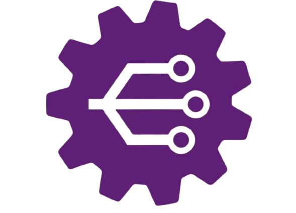

#  Plataforma de Cursos Online
Este projeto consiste no desenvolvimento front-end de uma plataforma de cursos utilizando **React**, implementando as interfaces disponibilizados no Figma.

## 📝 Padrão de Commits
-----------------------------------
- `create`: criação inicial do projeto
- `feat`: nova funcionalidade
- `fix`: correção de bug
- `docs`: alterações na documentação
- `style`: ajustes visuais
- `chore`: pequenos ajustes

## 🌿 Padrão de Branches
-----------------------------------
- `main`
Branch estável, versão oficial do sistema.

- `dev`
Branch de desenvolvimento, onde novas funções são integradas.

> 📌 Todas as novas funções e correções são feitas diretamente na branch `dev`.

## 🧰 Tecnologias Utilizadas
-----------------------------------
- **HTML5**
- **CSS3**
- **JavaScript**
- **React**
- **Vite**
- **Node.js**
- **npm**

## 🛠️ Pré-requisitos
-----------------------------------
- **Node.js 20+**
- **npm**
- **Git**

## 🚀 Instalação e Execução
-----------------------------------
1. Clone o repositório (utilizando ssh):
```
git clone git@github.com:Clarisse-Pimentel/Projeto-Trainee_Emakers-26-1.git
```
2. Entrar na pasta do projeto:
```
cd Projeto-Trainee_Emakers-26/1
```
3. Instalar as dependências:
```
npm install
```
4. Executar o projeto:
```
npm run dev
```
5. Abrir no navegador:
```
http://localhost:5173
```